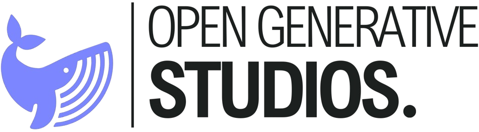

<p align="center">
  <a href="https://opengenerativestudios.studio/" target="_blank">
    
  </a>
</p>
<p align="center">
  <strong>
    <a href="https://opengenerativestudios.studio/" target="_blank" rel="noopener noreferrer">
      Open Generative Studios
    </a>
  </strong>
  — an open platform for machine learning-based music generation and audio rendering.
</p>

*Faculty of Sciences, University of Monastir: Final-Year Bachelor's Project in Software Engineering and Intelligent Systems*

---

## Table of Contents

1. [Abstract](#abstract)
2. [Glossary](#glossary)
3. [General Introduction](#general-introduction)
 - [General Context](#general-context)
 - [The Musical Era of Artificial Intelligence](#the-musical-era-of-artificial-intelligence)
 - [Problem Statement](#problem-statement)
 - [Philosophy and Objectives](#philosophy-and-objectives)
 - [Methodological Overview](#methodological-overview-iterative-architecture-centric-development-unified-process)
4. [Chapter 1: Inception: Vision, Context, and Technological Foundation](#chapter-1--inception-vision-context-and-technological-foundation)
 - [Introduction](#introduction)
 - [Analysis of the Existing Landscape](#analysis-of-the-existing-landscape)
 - [System Overview](#system-overview)
 - [Justification of Technological and Architectural Choices](#justification-of-technological-and-architectural-choices)
 - [Target Architecture: 6-Microservice Pipeline](#target-architecture-6-microservice-pipeline)
 - [Initial Infrastructure Setup](#initial-infrastructure-setup)
 - [Inception Assessment](#inception-assessment)
5. [Chapter 2: Elaboration: Architecture and Music Generation Pipeline](#chapter-2--elaboration-architecture-and-music-generation-pipeline)
 - [Introduction](#introduction-1)
 - [System Architecture](#system-architecture)
 - [Application Gateway Service](#application-gateway-service)
 - [Composition Service](#composition-service)
 - [MIDI Post-Processing Service](#midi-post-processing-service)
 - [Audio Rendering Service](#audio-rendering-service)
 - [Musical Notation Service](#musical-notation-service)
 - [Notification Service](#notification-service)
 - [Elaboration Assessment](#elaboration-assessment)
6. [Chapter 3: Construction: Application Services, User Experience, and Quality](#chapter-3--construction-application-services-user-experience-and-quality)
 - [Introduction](#introduction-2)
 - [Security and Authentication](#security-and-authentication)
 - [Billing and Bundle Management](#billing-and-bundle-management)
 - [Client Web Application](#client-web-application)
 - [Admin Dashboard](#admin-dashboard)
 - [Quality Assurance and Observability](#quality-assurance-and-observability)
 - [Construction Assessment](#construction-assessment)
7. [Chapter 4: Transition: Deployment, Operations, and Perspectives](#chapter-4--transition-deployment-operations-and-perspectives)
 - [Introduction](#introduction-3)
 - [Infrastructure and Deployment](#infrastructure-and-deployment)
 - [Lessons Learned](#lessons-learned)
 - [Transition Assessment](#transition-assessment)
8. [General Conclusion](#general-conclusion)
9. [Appendix A: Technology and Audio Reference](#appendix-a--technology-and-audio-reference)
10. [Appendix B: VPO Catalog](#appendix-b--vpo-catalog)
11. [Appendix C: Detailed Music Dictionary](#appendix-c--detailed-music-dictionary)
12. [Appendix D: Musical Intent Document: Role and Structure](#appendix-d--musical-intent-document-role-and-structure)
13. [Appendix E: API Endpoint Reference](#appendix-e--api-endpoint-reference)
14. [References](#references)

---

## Abstract

The dominant music generation platforms produce audio in an opaque manner, without structural control or inspectable intermediate artifacts. This report presents Open Generative Studios, a web platform for orchestral music generation designed as a transparent, reproducible, and GPU-free alternative.

The chosen architecture is a Staged Event-Driven Architecture (SEDA) with six microservices connected by Redis queues: client web application, composition engine, MIDI service, audio rendering service, notation service, and notification gateway. Development followed the Unified Process in four phases: Inception, Elaboration, Construction, and Transition.

Music generation relies on a hybrid stack: a large language model (Claude Haiku) translates the user prompt into a structured intent document (JSON), then three lightweight models take over. A Random Forest (200 trees, MAESTRO corpus) predicts the velocity and duration delta of each note. A third-order Markov chain (Lakh MIDI corpus) models melodic progression by genre. A K-Means model (Lakh MIDI corpus) selects rhythmic patterns based on the energy level of each section. A deterministic post-processing chain ensures musical coherence (tonal filtering, tessiture constraint, timeline normalization), before fully scriptable audio rendering via Sfizz/SFZ. The pipeline produces inspectable and replayable artifacts at each step: MIDI layers, WAV stems, final mix, and PDF score.

The system also integrates a comprehensive security module (JWT authentication, OAuth, encryption, rate limiting), credit-based billing (Lemon Squeezy), real-time observability via Server-Sent Events, error management via Dead Letter Queues, an automated CI/CD pipeline via GitHub Actions, and reproducible multi-cloud deployment on DigitalOcean Droplets and Azure App Service, with Supabase and MongoDB Atlas for data persistence.

---

## Glossary

| Term | Definition |
|------|------------|
| ACME | Automated Certificate Management Environment: a standard protocol enabling full automation of TLS certificate issuance, validation, and renewal. |
| Amazon SES | Amazon Simple Email Service: Amazon's cloud service dedicated to sending transactional and marketing emails at scale. |
| API | Application Programming Interface: a software interface allowing applications to access features or data in a structured manner. |
| Artifact | A result produced by a process or pipeline, in the form of a file or usable piece of data. |
| Bagging | Bootstrap Aggregating: an ensemble method training multiple models on random sub-samples to reduce variance. |
| BPM | Beats Per Minute: a unit measuring musical tempo as the number of beats per minute. |
| CDN | Content Delivery Network: a distributed infrastructure serving web content as close to users as possible. |
| CI/CD | Continuous Integration / Continuous Delivery: a set of practices automating software integration, testing, and deployment. |
| Container | An isolated, portable execution environment for running an application with its dependencies. |
| Corpus | A structured set of data used for training or evaluating models. |
| CPU | Central Processing Unit: the main processor executing the instructions of a computing system. |
| CSR | Client-Side Rendering: an interface rendering technique executed directly in the browser. |
| DAW | Digital Audio Workstation: software dedicated to audio production, recording, and editing. |
| DKIM | DomainKeys Identified Mail: a cryptographic signing mechanism ensuring the authenticity of emails. |
| DLQ | Dead Letter Queue: a queue receiving messages that failed processing. |
| DMARC | Domain-based Message Authentication, Reporting and Conformance: an email validation policy combining SPF and DKIM. |
| DNS | Domain Name System: a system translating domain names into IP addresses. |
| Feature | An input variable used by a machine learning model. |
| Message Queue | An asynchronous communication mechanism based on message queues. |
| GPU | Graphics Processing Unit: a processor specialized in intensive parallel computation. |
| Headless | A mode of execution without a graphical interface. |
| HMAC | Hash-based Message Authentication Code: an authentication mechanism based on a hash function and a secret key. |
| HPF | High-Pass Filter: an audio filter that lets high frequencies through while attenuating low frequencies. |
| Idempotent | A property of an operation that always produces the same result, regardless of how many times it is executed. |
| JSON | JavaScript Object Notation: a lightweight format for structuring and exchanging data. |
| JWT | JSON Web Token: a signed token used for authentication and secure information transfer. |
| LLM | Large Language Model: an artificial intelligence model trained on vast text corpora. |
| Microservices | A software architecture composed of independent, specialized services. |
| MIDI | Musical Instrument Digital Interface: a communication protocol between instruments and software. |
| MVP | Minimum Viable Product: a minimal initial version of a product allowing an idea to be validated. |
| PaaS | Platform as a Service: a cloud model providing a complete application deployment platform. |
| PDF | Portable Document Format: a universal document format preserving layout. |
| Pipeline | A chain of processes executed sequentially or in a structured manner. |
| Prompt | A textual instruction provided to a model to generate a response. |
| SaaS | Software as a Service: a software distribution model accessible via the Internet. |
| SEDA | Staged Event-Driven Architecture: a software architecture based on stages connected by event queues. |
| SFZ | An open format describing sampled instruments. |
| SPF | Sender Policy Framework: a mechanism indicating servers authorized to send emails on behalf of a domain. |
| SSE | Server-Sent Events: a mechanism enabling a server-to-client data stream via HTTP. |
| SSR | Server-Side Rendering: an interface rendering technique performed server-side. |
| Stem | An isolated audio track corresponding to a source or instrument. |
| TLS | Transport Layer Security: a protocol ensuring the security of network communications via encryption. |
| VPO | Virtual Playing Orchestra: a library of orchestral instruments in SFZ format. |
| VST | Virtual Studio Technology: a standard for audio plug-ins in music production software. |
| WAV | Waveform Audio File Format: an uncompressed audio format. |
| Webhook | An HTTP mechanism for automatically triggering a notification upon an event. |

---

## General Introduction

### General Context

This research was conducted at the Faculty of Sciences of the University of Monastir, as part of a final-year computer science project. It sits at the intersection of software engineering, machine learning, and audio technologies, in response to the challenges of computer-assisted music production.

### The Musical Era of Artificial Intelligence

The rise of artificial intelligence is reshaping the contours of the global music industry at a speed few technological revolutions have matched. What a decade ago was the domain of fundamental research has become a measurable economic reality: the global AI-in-music market reached $4.48 billion in 2025 and is expected to grow to $5.55 billion in 2026, peaking at $12.86 billion by 2030, with a compound annual growth rate of 23.4%. This trajectory reflects a structural transformation of the music value chain, from composition and production through to distribution and personalized recommendation. Driven by deep learning, transformer architectures, and natural language processing, generative systems have reconfigured creative practices, opening unprecedented possibilities for the amateur composer as well as the professional musician.

### Problem Statement

The dominant commercial platforms learn directly from raw audio corpora and synthesize sound in the absence of any symbolic representation (musical score, harmonic encoding, or interpretable MIDI representation). These systems operate as true black boxes: their outputs are audible, but their internal reasoning remains impenetrable, making it impossible to justify the choice of a note, reproduce a result, or exercise genuine harmonic control.

This opacity deprives the composer of mastery: they can neither correct a specific musical decision, nor reuse a generation as a starting point, nor translate the result into a score usable by real musicians.

The central question of this work is therefore: is it possible to design an orchestral music generation system that restores compositional control to the composer, while combining computational lightness with algorithmic transparency? The Open Generative Studios project attempts to answer this by articulating specialized services, lightweight GPU-free models, and a processing chain in which each step remains visible, modifiable, and replayable at will. The platform supports the composer in an iterative process: each generation is part of a persistent conversation, refined through exchanges, and results in a printable score, a concrete bridge between digital creation and the real musical world, directly usable by musicians, ensembles, or orchestras.

#### Value Added by the Project

The project distinguishes itself through three properties centered on the composer's experience: iterative composition within a persistent conversation, allowing the creation to be refined over exchanges without starting from scratch. A printable score directly usable by real musicians, opening digital creation toward the real musical world. And a transparent architecture where each step of the pipeline remains inspectable, modifiable, and replayable at will.

### Philosophy and Objectives

The platform rests on a conviction: one should never blindly trust a machine to create music. Rather than delegating the process to an opaque model, the system makes every creative gesture visible: a text prompt becomes a structured musical intent, which breaks down into MIDI note layers passing through a controlled post-processing stage, giving rise to an orchestral audio rendering and a printable score. Nothing is concealed. Everything is traceable.

Each step is a link that can be grasped, modified, or replayed without disrupting the whole. This granularity changes everything: it restores the composer's ability to intervene at every moment of the creative process.

From this philosophy derive five objectives:

- Transparency at every processing step
- Fine musical control over structure and dynamics
- A modular architecture with delimited responsibilities
- The ability to faithfully reproduce a generation and retrace each step
- A production deployment backed by security, billing, and supervision mechanisms

### Methodological Overview: Iterative Architecture-Centric Development (Unified Process)

The Unified Process (UP) is an iterative and incremental software development methodology, architecture-centric, use-case driven, and risk-directed. It aims to progressively build an executable software system while validating major technical and architectural choices early and continuously. This approach significantly reduces uncertainty and manages project risks from the first iterations.

The project follows the Unified Process, structured in four phases from design to production:

- **Chapter 1: Inception**: a short initialization phase dedicated to the system's vision, context, and technological foundation.
- **Chapter 2: Elaboration**: the main phase devoted to architecture and the music generation pipeline.
- **Chapter 3: Construction**: the main phase focused on application services, user experience, and quality.
- **Chapter 4: Transition**: a short closing phase covering deployment, operations, and system perspectives.

This choice is justified by the architectural nature of the system: a sequence of services whose coherence rests on fragile technical contracts - exchange formats between services, data distribution, loading of machine learning models, and instrumented audio rendering. The failure of a single one of these contracts is enough to invalidate all downstream processing.

The elaboration phase is essential as a risk management mechanism: it demands architectural validation before any resource commitment, where an agile method like Scrum would dilute this risk without guaranteeing early architectural closure, and where a sequential method like the waterfall cycle would defer it to the end of the project.

The result is a relevant compromise, combining controlled iteration and explicit milestones, allowing validation of the complete pipeline's viability at small scale before any real deployment. This logic aligns with the system's risk zones and suits an MVP-oriented solo development: four phases to de-risk the architecture and validate critical hypotheses, without the overhead of frameworks designed for large teams.

---

## Chapter 1: Inception: Vision, Context, and Technological Foundation

### Introduction

The Inception phase frames the problem before any development: dominant platforms process raw audio, limiting control and transparency. A different approach is adopted here, centered on MIDI as a pivot, with an architecture where each step remains inspectable, modifiable, and produces a usable score. This chapter presents the system, justifies the technological choices, describes the SEDA architecture with six microservices, and offers an assessment.

### Analysis of the Existing Landscape

The music generation landscape is dominated by audio-first, prompt-driven solutions oriented toward direct rendering. The analysis below synthesizes their limitations from the composer's perspective.

- **Suno:** prompt-to-audio generation for the general public. Version 4.5 focuses primarily on expanding styles, improving vocals, and tracks up to eight minutes. Structure and instrumentation meta-tags can orient the model, but act only as simple probabilistic signal weights - suggestions without guarantees of reproducibility or symbolic artifact output. The composer can neither correct a precise musical decision nor export a usable score.
- **Udio:** significant residual variability despite the addition of continuation and section-by-section remixing. Each generation starts from scratch without memory of the original intent, making any iterative approach laborious.
- **Google DeepMind (MusicLM/AudioLM):** research results with restricted access, no composer interface, and no tooling for fine orchestration.
- **Meta (MusicGen):** open-source model with no native symbolic representation or score export. The composer obtains an audio rendering with no leverage to modify its structure, instrumentation, or harmony.
- **Stability AI (Stable Audio):** advanced audio control among audio-first tools, but intermediate artifacts remain inaccessible and no score is produced.
- **AIVA:** partial exception with a piano roll editor and native MIDI export on all pricing tiers. The platform remains centered on predefined styles across more than 250 genres, with no persistent conversation or iterative workflow.
- **Soundraw / Boomy:** template-guided solutions, limited customization, and exclusively audio outputs - no score, no symbolic control.

These limitations converge toward three structural gaps from the composer's perspective:

- **Iterative composition:** each generation is part of a persistent conversation, refined through exchanges, without starting from scratch with each prompt.
- **Usable score:** each composition results in a printable score, directly readable by musicians, ensembles, or orchestras.
- **Musical control:** each composition retains a symbolic representation of structure, instrumentation, and dynamics, adjustable deterministically - unlike the probabilistic signal weights of audio-first systems.

Additionally, the system relies on classical machine learning models built around MIDI symbolic representations, with no GPU at inference time, reducing operational costs and latency.

### System Overview

The project takes the form of a SaaS web application capable of transforming a musical intent expressed in natural language into an audio production accompanied by its score. The user simply submits a description from the studio interface: the platform verifies their identity and credit balance, then automatically orchestrates a chain of specialized services that pass work to one another. A language model first interprets the musical intent, before a succession of dedicated steps progressively builds the composition, refines it, synthesizes it into audio, and sets it to score. Throughout the process, the studio interface reflects the generation progress in real time. Once complete, the audio and score are directly accessible from the conversation space, while an administration dashboard provides an overview of accounts, credit consumption, and system health.

### Justification of Technological and Architectural Choices

#### Interface and Web Applications

Next.js App Router powers two applications with distinct needs. The first exposes two environments: server-side rendering (SSR) for project discovery, documentation, and authentication - optimized for SEO - and client-side rendering (CSR) for the real-time interactive experience where interactions are orchestrated and pipeline progress becomes visible. The admin dashboard relies on the same server-side rendering, keeping protected routes out of reach on the client side. Both applications share the same technical base: TypeScript, React, Tailwind CSS, and HeroUI, preventing any structural divergence. On the back end, Node.js covers web routes, sessions, Redis queues, and billing, while musical processing belongs to dedicated Python services.

#### Persistence and Inter-Service Communication

MongoDB ensures persistence of application data thanks to its document model, naturally aligned with the nested structures and complex metadata produced by the composition engine. Supabase, built on PostgreSQL, manages identity, credits, and purchases with strict transactional guarantees. Redis serves as a queue bus between pipeline steps and provides route rate limiting. Final artifacts (WAV, PDF, MIDI) are published to DigitalOcean Spaces, an S3-compatible object storage.

#### Artificial Intelligence and Machine Learning

Claude Haiku, selected for its native JSON output and prompt caching, converts the user prompt into a structured musical intent (JSON), bridging natural language and generation. Three models, relying on Scikit-learn and NumPy for processing MIDI symbolic representations, then take over. Artifacts are produced on Kaggle and versioned on Hugging Face.

#### Musical and Audio Processing

The mido library handles reading, writing, and transforming MIDI files. Orchestral rendering relies on Sfizz and the SFZ format, covering classical families: strings, winds, brass, and percussion - without depending on a DAW or proprietary VST plugins. Pedalboard applies audio effects from Python, including reverb, compression, and equalization. MIDI-to-PDF score conversion is handled by the MuseScore CLI.

#### Security

Sessions use JWT tokens stored in HttpOnly and Secure cookies in production. Passwords are hashed with bcrypt, and email verification and reset flows rely on time-limited tokens. Protected routes verify the session before any action, then filter conversations, songs, accounts, and MIDI/WAV/PDF files by owner ID. Google OAuth authentication completes the standard flow. Rate limiting is based on Redis, with an in-memory fallback if unavailable.

#### Infrastructure and Deployment

Docker and Docker Compose provide a reproducible environment in both development and production. GitHub Actions automates linting, testing, and deployment. In production, the client application, Python services, and Redis run on a DigitalOcean Droplet, with Caddy handling TLS termination via Let's Encrypt. The domain is managed through Name.com, facilitating DNS configuration and subdomain delegation. The admin dashboard is deployed separately on Azure App Service.

#### Billing and Communication

Lemon Squeezy manages payment sessions and webhooks crediting user accounts, simplifying tax compliance as Merchant of Record. Resend handles transactional emails for verification and password reset.

#### Documentation Tooling

LaTeX and Grammarly ensure report writing. UML diagrams are produced with Draw.io and flow representations with Mermaid.

### Target Architecture: 6-Microservice Pipeline

#### Why a Microservices Architecture

Rather than an opaque monolith, the system deploys as a chain of specialists where each service masters its domain, ignores the rest, and passes the work on. This decomposition addresses four concrete requirements:

- **Assumed heterogeneity:** each service adopts the stack best suited to its responsibility.
- **Surgical deployment:** a change in the composition engine does not require redeploying the audio rendering service, reducing regression risk and accelerating delivery cycles.
- **Targeted scalability:** the most resource-intensive steps can be scaled independently of lightweight steps.
- **Compartmentalized resilience:** the failure of one service does not bring down the entire system. Queues absorb delays and allow recovery after incidents.

#### Why SEDA

Processing follows an immutable sequence: text, then musical intent, then raw symbolic notation, then stabilized symbolic notation, then stereo audio signal, then printable score. This sequence is erected by the architecture into explicit contracts between independent processing agents, connected by queues. This pattern naturally suits music generation for several reasons:

- **Observability:** each queue constitutes a measurement point, and pipeline progress is traceable in real time from the notification gateway.
- **Temporal decoupling:** a slow step does not block preceding ones, and a failed step can be retried without restarting the pipeline from the beginning.
- **Gradual debugging:** intermediate artifacts remain inspectable between steps, facilitating diagnosis of musical quality issues.

#### The Six Pipeline Services

Each processing service adheres to a single responsibility, communicates exclusively via Redis, and produces an inspectable artifact. The notification gateway provides transversal pipeline observability.

1. **The client web application** (Node.js/Next.js) is the platform's single entry point and the only interface exposed to the user. It handles authentication, session management, and credit balance verification before accepting any generation request. Once validated, it builds the job context and submits it to the queue. At the end of the pipeline, it retrieves produced artifacts and makes them accessible.

2. **The composition engine** (Python) is the pipeline's cognitive core and the only service authorized to invoke a language model. Upon receiving a job, it submits the prompt to Claude Haiku to extract a musical intent, then validates requested instruments against the VPO catalog to guarantee their compatibility with SFZ rendering. It then drives the three specialized models - rhythm, melody, and expression - to produce raw MIDI layers before publishing to the next queue.

3. **The MIDI service** (Python) is the pipeline's deterministic stabilization step. It makes no creative decisions but guarantees that symbolic data from composition is clean and coherent before reaching audio rendering. It normalizes velocities by section based on the intent, aligns and clips the timeline, closes any unfinished active notes, and applies deterministic fallbacks on empty layers. It calculates a traceability manifest to guarantee artifact integrity for downstream services.

4. **The audio rendering service** (Python) is the only service in the pipeline to produce audio. It loads instrument assignments, then synthesizes each MIDI track independently via the SFZ/Sfizz engine, relying on orchestral samples covering strings, winds, brass, and percussion families. The resulting stems are assembled into a stereo mix to which mastering effects are applied - reverb, compression, and equalization.

5. **The notation service** (Python) materializes the composition as a readable, printable, and shareable score. It consumes the post-processed MIDI files and invokes the MuseScore CLI to convert them into a PDF score, producing a conductor's score as well as individual instrument parts. This step is triggered after audio rendering, as the user must have their audio rendering before receiving their score.

6. **The notification gateway** (Python) is the system's transversal event hub, orthogonal to the processing pipeline. It continuously ingests statuses published by processing services, timestamps them, and stores them in a structured in-memory buffer. It exposes a real-time SSE stream to the client reflecting job progress step by step, as well as supervision routes for inspecting queue states, Dead Letter Queue contents, and service availability.

Jobs in error are isolated and routed to a dedicated DLQ, providing a structured diagnostic space and the possibility of targeted replay without disrupting the main flow.

### Initial Infrastructure Setup

#### Docker Compose Environment

A locally executable environment was set up during the Inception phase using Docker Compose, grouping the client web application, Python pipeline services, Redis, and the inter-service network within a unified configuration. All components start with a single command, ensuring development environment reproducibility and eliminating system dependency issues.

#### Initial Queue Communication Validation

The minimal ingestion and queue transfer flow was validated with Redis BRPOP/LPUSH semantics. This validation confirmed that the inter-service communication mechanism works correctly: a message pushed by one service is reliably consumed by the next. The blocking behavior of BRPOP ensures that a waiting service does not consume resources unnecessarily and wakes up as soon as a message becomes available.

### Inception Assessment

#### Results Achieved

The Inception phase validated the project's foundations: the pipeline is executable, service boundaries are defined, Redis queue communication works end-to-end, and the Docker Compose infrastructure allows reproducible startup of the entire system.

#### Identified Limitations

Final musical quality has not yet been validated at this stage. Inception prioritized architectural framing, technical contracts, and orchestration feasibility rather than audio output optimization.

#### Challenges Deferred to Elaboration

The Elaboration phase must transform these technical boundaries into reliable, observable services capable of producing usable musical artifacts. Each validated hypothesis must become a concrete constraint, upheld by code and verifiable at runtime:

- Implementation of the six services
- Stabilization of message contracts
- End-to-end flow validation
- Integration of the generation stack
- Minimal observability

---

## Chapter 2: Elaboration: Architecture and Music Generation Pipeline

### Introduction

The Inception phase laid the foundations and identified the structural challenges of the architecture. The Elaboration phase transforms them into concrete constraints, implemented and verifiable at runtime. This is where architectural hypotheses are tested and major risks are resolved before any investment in quality and user experience.

### System Architecture

#### SEDA Implementation

The six services defined in Inception were deployed and interconnected according to the established topology, without major structural modification. Implementation revealed two concrete adjustments: the need for an explicit timeout on BRPOP to avoid silent blocking during service restarts, and message enrichment to allow distinction between initial processing and DLQ replay. These adjustments were integrated into message contracts without altering the planned topology.

#### Queue Contracts and Resilience

Elaboration froze the payloads circulating between services. Each job carries a unique identifier, the musical intent metadata, and paths to artifacts from the previous step. This uniform message contract guarantees that a service can be replaced or restarted without compromising data readability for the next service.

Jobs placed in the DLQ retain their full failure context: error message, timestamp, and attempt number. This traceability enables precise diagnosis and targeted replay without disrupting the main flow.

#### End-to-End Flow

The pipeline transforms a free-text prompt into a set of structured musical artifacts through five successive steps, each producing an independently inspectable artifact:

- Text prompt transformed into an intent JSON object
- Intent processed into raw MIDI via the composition model stack
- Raw MIDI stabilized into post-processed MIDI
- Post-processed MIDI rendered into mixed audio: separate tracks (stems) and a final WAV mix
- MIDI converted into a PDF notation score

### Application Gateway Service

The client web application is the user gateway: it applies authentication, ownership controls, bundle policies, and generation cost. As the sole access point to data, all its routes are protected by Supabase session verification, and owner identity is checked before any operation, guaranteeing data isolation between users.

Sending the first message triggers generation initialization: the API validates the session and request context, dynamically calculates cost from the configuration table (combining a fixed intent extraction cost via Haiku and a variable cost depending on the number of layers and composition duration), then launches asynchronous job processing.

Job cancellation follows a security and cleanup chain: session verification, Redis task removal, song cancellation, and pending response purge.

### Composition Service

The composition engine is the pipeline's richest step. It consumes and chains four phases: intent extraction, instrumental resolution, multi-model musical generation, and artifact persistence.

#### Intent Extraction and Instrumental Resolution

Upon receiving a job, the engine submits the user prompt to Claude Haiku, which returns an intent structure in JSON format containing tempo, key, genre, sections, and instrument list. The intent is then validated against the VPO catalog to ensure that each requested instrument corresponds to a real entry with a tessiture and SFZ mapping usable by downstream stages.

#### Music Generation Stack: A Hybrid Approach

Raw MIDI generation relies on a tripartite architecture, each module assuming a distinct dimension of musical expression. This hybrid paradigm is deliberate: no single model simultaneously covers rhythmic structure, melodic conduct, and dynamic expressivity. Hardware constraints (training and inference on CPU without GPU) oriented the choice toward lightweight, modular architectures rather than a large autoregressive model.

The chosen corpora present a structural complementarity based on distinct properties:

- **MAESTRO (Google Magenta):** a reference corpus in symbolic music generation, constituted within Google's Magenta project and recognized for the rigor of its MIDI piano performances aligned with human interpretation.
- **Lakh MIDI Dataset:** a MIDI dataset widely exploited in the music generation literature, distinguished by the breadth of its stylistic coverage, the variety of its melodic patterns, and the richness of its rhythmic structures.

This complementarity combines expressivity and stylistic breadth within the same training framework.

##### a. Expressive Component

The Random Forest was retained for the expressive component because it efficiently models non-linear relationships between musical context, velocity, and duration micro-variation without depending on a large sequential model. In this configuration, 200 trees train two independent heads: the first predicts MIDI velocity (0-127), the second predicts the duration delta δ, defined by:

```
δ = (actual duration − quantized duration) / quantized duration, δ ∈ [−0.9, 2.5]
```

to suppress extreme timing artifacts.

**Data and train/test split:**

| Set | MIDI Files | Supervised Notes |
|-----|------------|-----------------|
| Training | 800 (80%) | 600,000 |
| Test | 200 (20%) | 150,000 |
| Total | 1,000 | 750,000 |

The script processes 1,000 MAESTRO MIDI files (0 read failures, 5,494,277 notes total). The split is performed at the file level (all notes from the same piece remain in the same set), avoiding any data leakage between notes from the same recording.

**Feature vector (21 dimensions):**

| Variable | Meaning |
|----------|---------|
| Pitch | MIDI value of the current note (0-127) |
| Interval | Signed pitch jump from the previous note |
| Absolute interval | Absolute value of the jump (magnitude without direction) |
| Previous pitch | MIDI value of the immediately preceding note |
| Next pitch | MIDI value of the immediately following note |
| Position in sequence | Normalized rank of the note in the track (0-1) |
| Local density | Number of notes within a +/-6 note window |
| Pitch class | Chroma (0-11, octave-independent) |
| Octave | Octave register of the note |
| High register | Binary indicator: pitch >= 72 (mid-E and above) |
| Low register | Binary indicator: pitch <= 48 (mid-C and below) |
| Previous duration | Quantized duration of the previous note |
| Current duration | Quantized duration of the note (excluded from the delta head) |
| Duration ratio | Ratio of current duration to the rolling mean of durations |
| Dynamic context | Exponential moving average of intensities (alpha=0.15) |
| Attack gap | Time interval between two consecutive attacks |
| Formal section | Structural section identifier (0=intro to 4=outro) |
| Position in section | Normalized rank of the note in its section (0-1) |
| Duration context | Exponential moving average of actual durations (alpha=0.10) |
| Phrase-end distance | Remaining proportion until the end of the current phrase |
| Next duration | Quantized duration of the following note |

**Hyperparameters:**

- 200 decision trees trained in parallel via bagging, each on a distinct random sub-sample of data and features
- Velocity head: max depth 18, min leaf size 3
- Delta-duration head: max depth 14, min leaf size 6
- Out-of-bag score enabled on both heads

**Validation metrics:**

| Metric | Interpretation | Velocity | Delta-duration |
|--------|---------------|----------|----------------|
| R² (test) | Fraction of variance explained on unseen data | 0.616 | 0.377 |
| R² (train) | Same indicator on training data | 0.760 | 0.431 |
| OOB R² | Implicit cross-validation without a dedicated set | 0.600 | 0.375 |
| MAE (test) | Mean absolute error on the target scale | 8.70 | 0.194 |

The velocity MAE (8.70) is on a 127-level scale: it represents an error of less than 7% of the total range. The OOB/test agreement (0.600 vs 0.616) confirms the absence of data leakage. The dominant importance of dynamic context (63%) confirms that a note's intensity strongly depends on the immediately preceding dynamics.

##### b. Melodic Component

The third-order Markov chain was retained for melody because it captures sufficient local context to orient the musical phrase without incurring the cost of a deep autoregressive model. It is also naturally probabilistic: temperature allows dosing predictability and variation - two essential properties for generating several plausible lines from the same intent. The model predicts the next scale degree from the previous three: P(dn | dn-3, dn-2, dn-1).

Laplace smoothing (alpha=0.25) guarantees non-zero probabilities on rare contexts, ensuring full inference coverage.

**Data and train/test split:** the Lakh MIDI corpus with up to 2,500 candidate files per genre. 12 genres covered: cinematic, orchestral, classical, jazz, blues, rock, pop, ambient, electronic, folk, r-and-b, hip-hop.

**Perplexity interpretation** (reference: 7 notes in a diatonic scale):

| Perplexity | Musical Behavior |
|------------|----------------|
| 1-2 | Too repetitive / robotic |
| 2-3 | Very structured, little variety |
| 3-4 | Structured but limited |
| **4-5** | **Optimal balance: creativity and structure** |
| 5-6 | Varied but incoherent |
| 6-7 | Pure random (baseline) |

The model reduces uncertainty from 7 to ~4.86 on average: it has learned musical structure while preserving variety.

**Metrics by genre (test set):**

| Genre | Perplexity | Top-1 Accuracy | Coverage |
|-------|-----------|---------------|---------|
| blues | 4.29 | 38.9% | 100% |
| cinematic | 4.71 | 38.2% | 100% |
| electronic | 4.72 | 37.0% | 100% |
| r-and-b | 4.72 | 37.3% | 100% |
| hip-hop | 4.77 | 37.7% | 100% |
| rock | 4.91 | 36.2% | 100% |
| jazz | 4.92 | 37.1% | 100% |
| classical | 5.00 | 37.3% | 100% |
| pop | 5.02 | 36.6% | 100% |
| ambient | 5.05 | 35.9% | 100% |
| folk | 5.05 | 35.9% | 100% |
| orchestral | 5.12 | 35.2% | 100% |

Top-1 accuracy (~37%) should be compared to the random baseline of 1/7 = 14%: the model is 2.6 times more accurate than chance.

##### c. Rhythmic Component

K-Means was retained for the rhythmic component because measures can be described as binary attack vectors - a format well suited to unsupervised clustering. It extracts recurring groove families without manual annotation.

**Data and train/test split:** 230 Lakh MIDI files per genre, split into measures (bar-level split 80/20):

| Set | Measures/genre | Total (12 genres) |
|-----|---------------|------------------|
| Training | 20,050 | 240,600 |
| Test | 5,012 | 60,144 |
| Total | 25,062 | 300,744 |

**Metrics by genre (train and test):**

| Genre | k | Silhouette (train) | Silhouette (test) | Inertia (train) | Inertia (test) |
|-------|---|--------------------|-------------------|----------------|----------------|
| orchestral | 70 | 0.749 | 0.719 | 0.268 | 0.290 |
| rock | 60 | 0.723 | 0.719 | 0.305 | 0.299 |
| hip-hop | 60 | 0.708 | 0.708 | 0.306 | 0.308 |
| classical | 60 | 0.707 | 0.704 | 0.303 | 0.310 |
| cinematic | 60 | 0.699 | 0.716 | 0.305 | 0.297 |
| electronic | 60 | 0.696 | 0.708 | 0.303 | 0.302 |
| pop | 50 | 0.691 | 0.689 | 0.339 | 0.357 |
| r-and-b | 50 | 0.695 | 0.668 | 0.335 | 0.365 |
| folk | 50 | 0.678 | 0.692 | 0.342 | 0.349 |
| ambient | 50 | 0.670 | 0.680 | 0.341 | 0.354 |
| jazz | 50 | 0.686 | 0.691 | 0.350 | 0.330 |
| blues | 50 | 0.663 | 0.660 | 0.346 | 0.355 |

Silhouette (range -1 to +1) measures cluster separability: a value > 0.5 indicates well-distinct groups.

##### d. Experimentation Feedback

Models were trained and compared multiple times before settling on this configuration. Massively increasing the number of MAESTRO notes for the Random Forest did not improve measured quality: velocity R² on test remained around 0.61. Conversely, the melodic component clearly benefited from moving from a 2nd-order to a 3rd-order Markov chain with lower-order fallback: average perplexity dropped from ~5.29 to 4.86 and top-1 accuracy from ~33% to 37%.

#### Articulation of Models in the Composition Flow

These components do not function as three independent outputs but as a decision chain in the composition engine. The rhythmic component proposes attacks, the melodic component produces degrees, and the expressive component predicts intensities and durations. The result is structured musical material, ready to be written as intermediate artifacts.

### MIDI Post-Processing Service

This service does not compose. It stabilizes and normalizes symbolic outputs from composition to guarantee coherent material for audio rendering and notation. Current processing applies:

- Velocity adjustments by section based on the intent structure
- Timeline normalization and clipping, and safe closing of active notes
- Verification of produced layers and calculation of control fingerprints to trace transmitted artifacts

The result is transmitted to the audio rendering queue.

### Audio Rendering Service

This service transforms post-processed MIDI data into usable audio artifacts. It consumes the queue, loads instrument assignments from the configuration manifest, renders each MIDI stem independently via the SFZ/Sfizz engine (relying on orchestral samples covering strings, winds, brass, and percussion families), then assembles the final stereo mix applying volume and panning weights. Mastering effects (reverb, compression, equalization), the mix bus, and output levels are fully configurable via job configuration. The SFZ/Sfizz backend is used as priority for its native performance and timbral fidelity, with a Python fallback ensuring continuity of service if unavailable.

### Musical Notation Service

This service converts symbolic data from the pipeline into a structured musical score, intended for consultation, printing, and document export. It consumes the queue, invokes MuseScore CLI, and publishes pipeline completion.

For the user, this step materializes an inverted pedagogical approach: rather than learning notation to compose, the user first generates a composition from an intent expressed in natural language, then discovers its formal transcription as a score. This reversal of the traditional flow lowers the barrier to music theory and transforms each generation into a concrete, shareable learning resource playable by any musician.

### Notification Service

This service centralizes the pipeline's operational telemetry, ingests events from Redis and HTTP, and exposes them in real time to the client and supervision tools.

It maintains an in-memory buffer, persists logs, and exposes endpoints: `/health`, `/notify`, `/events` (SSE), `/jobs` (queue depth and DLQ). In practice, it plays a key role in observability, rapid bottleneck detection, and cross-service failure diagnosis.

### Elaboration Assessment

#### Results Achieved

The pipeline is operational end-to-end and produces the main artifacts (MIDI, audio, notation) with queue traceability and notifications. The hybrid AI stack covers the three fundamental dimensions of musical expression - rhythm, melody, and dynamics - using specialized, lightweight models trainable without a GPU.

#### Identified Limitations

Observed limitations concern mainly the raw model output. It remains usable, but must still be framed to guarantee instrumental register, harmonic stability, and legibility of orchestral rendering in real conditions.

#### Challenges Deferred to Construction

The Construction phase must concentrate effort on product hardening: documentary consistency, correction of minor service contract discrepancies, and industrialization of functional and musical validations.

---

## Chapter 3: Construction: Application Services, User Experience, and Quality

### Introduction

A functional pipeline is not yet a ready-to-use platform. The Construction phase transforms this pipeline into a finished product, giving each component the maturity necessary for coherent operation. Following Elaboration's focus on validating the generation flow and orchestration, this phase industrializes the client interface, finalizes billing, introduces an admin dashboard, and consolidates quality, security, and system observability.

### Security and Authentication

#### Core Mechanisms

Sessions use JWT tokens stored in HttpOnly and Secure cookies in production. Passwords are hashed with bcrypt, while email verification and reset flows rely on time-limited tokens. Protected routes verify the session before any action, then filter conversations, songs, accounts, and MIDI/WAV/PDF files by owner ID.

Control is applied in layers. Middleware intercepts access to private pages and routes. API handlers re-verify identity before executing any sensitive operation.

Error responses remain neutral to avoid revealing account existence. Google OAuth completes the local flow without bypassing these controls. After provider validation, the server links the identity to an internal account and applies the same quotas. Rate limiting based on Redis (with in-memory fallback) protects authentication entry points.

#### Authentication Flows

Registration and email verification form the account activation foundation: controlled creation, sending of a signed link, then explicit server-side validation before confirming identity.

Session entries (email or Google) converge to the same authentication service, and logout closes this cycle by immediate invalidation of the active session.

### Billing and Bundle Management

#### Lemon Squeezy Integration

Lemon Squeezy is used as Merchant of Record to fully delegate payment processing, tax management (including VAT), and all associated compliance obligations. The application retains only business responsibilities: verifying the user session, validating the chosen bundle, creating the payment session, and automatically crediting keys after payment confirmation.

The flow remains short: checkout is initiated server-side, then signed webhooks synchronize the payment with the user's internal wallet.

After settlement, Lemon Squeezy transmits a signed webhook to the platform's API. The server verifies the HMAC signature, checks idempotency via the event identifier, then associates the payment with the user and acquired bundle. If the event is new, keys are credited to the wallet and the operation is recorded in the purchase history.

#### Key Bundles

All users share the same generation engine. Differentiation is strictly economic and manifests through the available balance, without functional restriction tied to the chosen tier.

| Bundle | Usage Profile | Keys Credited | Target Usage |
|--------|--------------|---------------|-------------|
| Prelude | Discovery and qualification | 300 | Pipeline qualification and functional validation |
| Concerto | Regular production | 5,000 | Regular production and volume scaling |
| Mozart | Advanced and intensive use | 15,000 | Large orchestrations and intensive sessions |

#### Webhook Processing

The implementation rests on three successive guarantees: HMAC signature validation, idempotency check on the event identifier, then recording in the purchases table. This layered control ensures that a retransmission or transient network failure never compromises balance consistency or accounting traceability.

#### Usage Limits and Dynamic Cost

Before queuing, the server applies:

- User and current bundle eligibility verification
- Session limit and balance verification
- Dynamic cost calculation from two terms: Haiku intent extraction plus composition (layers, duration)
- Credit deduction then async dispatch

### Client Web Application

The client web application is the platform's main interface, rendered in SSR. It consists of two distinct spaces: a public space accessible without authentication (product presentation, pricing grid, documentation, and authentication), and a protected CSR space for real-time interactions, accessible after login, comprising the conversational studio, composition tracking, and account management.

#### Public Journey

The visitor discovers examples of music generated by the system along with a jumbotron presenting how the chat works and the path to downloading their composition.

#### Conversational Studio

The user has a sidebar providing access to their conversations. Dynamic prompt suggestions and musical description prompts display in the chat interface.

#### Client Dashboard

The user finds on this page total spending, key balance, number of generated pieces, and a summary of actions (prompts) with average cost per song.

#### Account and Bundles

The user has a summary view of key volume consumed over time and remaining balance, as well as average cost per piece. A chart showing activity breakdown by task (melody, harmony, rhythm, etc.) completes this dashboard.

### Admin Dashboard

#### Objective

The admin dashboard manages users, bundles, and costs. The administrator tracks indicators such as revenue to guide strategic decisions.

#### User and Bundle Administration

A paginated and segmented table allows the administrator to browse users line by line. The administrator can modify bundle prices and descriptions at any time, and can also update the generation cost according to the defined cost formula.

#### Metrics and Analytics

The dashboard exposes a set of analytical components (metric cards, trend charts, and performance indicators) that continuously monitor platform activity, usage, and economic data. Selected indicators (key consumption, generation rate, revenue, and failure rate) cross technical and economic dimensions to pilot a production platform.

The admin interface does not access the database directly. Reads and writes transit through dedicated admin routes before being persisted in Supabase.

### Quality Assurance and Observability

#### Operational Positioning of the Composition Stack

In the Construction phase, the objective changes profoundly. Rather than exposing learning results, the goal is to verify what these models produce when integrated into a complete user journey. Generation tests confirmed that the probabilistic stack provides usable musical material, while revealing that this material sometimes remains too free to guarantee on its own a stable orchestral output.

Concretely, the models know how to propose degrees, attacks, intensities, and durations. They do not always guarantee the correct instrumental register, consonance at strong positions, clear separation between bass, harmony, and melody, or coherent restitution of musical intentions such as certain articulations or rhythmic effects. The Construction phase therefore introduced a deterministic layer placed after prediction, whose role is to frame model output without erasing its diversity.

#### Design of the Deterministic Layer

##### a. Tonal Filtering and Register Constraint

Tonal filtering is the most structuring decision. A prediction can be statistically plausible while becoming problematic once projected onto a real instrument. To avoid this, the system builds for each instrument a set of authorized pitches from the requested key and the tessiture available in the VPO catalog, then maps generated notes to this space before MIDI writing. This filtering occurs downstream of the model transparently: prediction logic is not modified, but its outputs are corrected if they exceed defined limits.

##### b. Initial Placement by Role

The engine now assigns a starting point consistent with the role of each layer. Bass is initialized in a low zone, harmonies occupy the middle register, and melody starts in a more legible zone. This makes layer separation more stable from the first notes.

##### c. Structural Harmonic Alignment

The harmonic alignment corrects notes by bringing main melody pitches closer to the chord tones of the current progression. Correction is limited to structural positions in order to preserve the melodic contour between measures.

##### d. Post-Prediction Expressive Adjustment

Three corrections are applied after prediction:

- The energy factor increases or decreases intensities according to the section level
- The mood nuance introduces a global offset when the intent requires calmer or more energetic rendering
- The genre dynamic range limits extreme values to maintain a coherent sonic identity

##### e. Articulatory Shaping and Rhythmic Humanization

Staccato shortens notes detaching them from one another, pizzicato accentuates the cut simulating plucked playing, and sustain slightly extends sound duration to soften transitions. When the style requires it, swing delays certain eighth notes according to a configurable ratio, giving a more flexible, less mechanical phrasing.

##### f. Fallbacks and Robustness

In the absence of a melodic artifact, the engine uses genre-specific step probabilities. If rhythmic patterns are unavailable, simplified probabilistic generation is used. When no event is produced, a valid but silent MIDI file is generated nonetheless. This controlled degradation strengthens system robustness, preserves downstream services, and facilitates anomaly identification.

#### Efficiency Profiles of Components

The audit confirms the hybrid stack's compatibility with GPU-free deployment. The expressive component (~249 MB) remains viable on CPU via section vectorization. The melodic and rhythmic components present a negligible memory footprint with near-instantaneous inference. The deterministic post-prediction chain has linear complexity with no training overhead.

#### Service-Level Validation

The critical logic of each service was verified individually, covering raw MIDI generation accuracy, MIDI post-processing reliability, audio rendering behavior, and notation output legibility. Fallback scenarios for an empty layer, an instrument absent from the catalog, or a genre without a model were explicitly covered.

#### Queue Integration Verification

Integration validation covered the complete Redis queue chain: `composeQueue` → `midiQueue` → `renderQueue` → `notationQueue`

For each transition, the payload contract was verified with respect to the presence and format of required fields, artifact path coherence between services, and correct transmission of intent metadata including genre, tempo, and instrumentation.

Failure scenarios were also covered: abrupt stop of a consumer service, recovery after restart, and detection of orphaned messages in the DLQ - validating that the system reacts predictably without silent message loss or pipeline blocking.

#### End-to-End Scenario Tests

Representative prompts covering different genres, instrument configurations, and durations were run from submission to final artifact availability (WAV, MIDI, PDF). These tests validated intent metadata consistency with produced files and detected cases where automatic fallbacks were triggered.

### Construction Assessment

#### Results Achieved

At the end of this phase, the system covers the entire product path, from account creation to downloadable orchestral artifacts. Security, billing, observability, and diagnostics were built as first-class components, not added peripherally. On the musical side, real-condition tests confirmed that the deterministic layer and efficiency profiles produce stable outputs consistent with formulated musical intents.

#### Identified Limitations

Functional gains are confirmed, but validation took place entirely in a local environment. Behaviors specific to a production environment - such as real network load, inter-service latency, or cold-start conditions - have not yet been observed or measured.

#### Challenges Deferred to Transition

Multi-cloud deployment in a production environment, setting up the continuous delivery pipeline, domain and network security infrastructure configuration, end-to-end user journey validation, and a retrospective on methodological learnings accumulated throughout the project.

---

## Chapter 4: Transition: Deployment, Operations, and Perspectives

### Introduction

The Transition phase does not aim to enrich the system, but to demonstrate that what has been built is deployable, reproducible, and meets the requirements of a real project. This is where architectural decisions made upstream are confronted with the reality of a production environment.

### Infrastructure and Deployment

#### Local Environment

Docker Compose allows starting the entire system with a single command. The environment is identical from one machine to another, dependency issues are eliminated, and the developer works on a stable, audited base.

#### Production Architecture

The target deployment is multi-cloud, leveraging the strengths of each provider. Their choice does not rest solely on technical criteria - maturity of the ecosystem was also decisive: years of production use, reference documentation, and active communities capable of providing substantive answers constitute factors reducing exposure to operational risks.

**Deployment topology:**

- **DigitalOcean Droplet** hosts the system core: the web application, five pipeline services, and Redis. This grouping reduces inter-service latency and guarantees homogeneous deployment of the entire compute chain. Target machine: Ubuntu 24.04 LTS Droplet in region FRA1 (Frankfurt), with 4 GB RAM, 2 vCPUs, and 80 GB SSD. Each service being encapsulated in an independent Docker container communicating via Redis queues, no code-level dependency exists between them. Consolidation on a single Droplet is an infrastructure choice for the current stage. At scale, each service can be deployed on a dedicated Droplet with adapted resources, without modifying application code.

- **Azure App Service** hosts the admin dashboard, fully decoupled from the Droplet: it communicates directly with Supabase and MongoDB Atlas, and remains operational even in the event of a generation pipeline failure.

- **DigitalOcean Spaces** ensures storage of generated artifacts. S3 compatibility, CDN distribution, and signed URLs guarantee secure delivery of WAV, MIDI, and PDF files. With both the Droplet and bucket hosted in region FRA1, transfers occur without crossing network boundaries, minimizing latency and eliminating egress bandwidth costs.

- **Supabase** and **MongoDB Atlas** operate as managed data services, providing high availability, automatic backups, and observability without manual operation.

#### TLS Termination and Reverse Proxy

Caddy provides TLS termination and reverse proxy for all incoming traffic. It exposes two entry points: the main domain routed to the web application on port 3000, and the notification subdomain routed to the gateway on port 8088.

Certificate management relies on the ACME protocol and Let's Encrypt. On startup, Caddy automatically negotiates a valid TLS certificate from Let's Encrypt, stores it locally, and schedules renewal well before expiration, without any manual intervention. The ACME exchange uses an HTTP-01 challenge.

#### Domain and DNS Configuration

The platform domain was registered with **name.com**. Once DNS has propagated and certificates provisioned by Caddy, the platform is accessible at **opengenerativestudios.studio**.

| Type | Host | Value | TTL |
|------|------|-------|-----|
| A | @ | Droplet IP | 300 |
| A | ws | Droplet IP | 300 |

The TTL of 300 seconds (5 minutes) was chosen deliberately: it reduces propagation time during initial deployment and accelerates any address corrections.

#### Transactional Messaging Infrastructure

Transactional messaging is provided by **Resend**, which routes sends via **Amazon SES**. Three distinct sending streams are configured, each associated with a dedicated address:

- `support@opengenerativestudios.studio`: general communications and billing notifications
- `verify@opengenerativestudios.studio`: address verifications at account creation
- `security@opengenerativestudios.studio`: password resets and security alerts

This separation into independent streams ensures deliverability isolation (a reputation degradation on the verification stream does not affect critical billing or security streams), reinforces user trust (the sending address matches the expected use), and enables per-category analytical and operational tracking.

Email authentication relies on three DNS records configured on name.com and verified by Resend:

- **DKIM:** cryptographic signature of message headers
- **SPF:** TXT record declaring servers authorized to send on behalf of the domain
- **DMARC:** alignment policy indicating to destination servers how to handle messages failing DKIM and SPF checks, and enabling collection of abuse reports

#### Security and Continuous Deployment

TLS termination, minimal firewall exposure, and environment-isolated secrets constitute mandatory controls. Sensitive variables are injected per environment and never transit in Docker images.

A GitHub Actions CI/CD pipeline automates lint, tests, and continuous delivery to target environments.

#### Cost Analysis

| Provider | Key Advantage | Cost |
|----------|--------------|------|
| DigitalOcean Droplet | Low internal latency, uniform runtime | $24/month |
| Azure App Service F1 | Web publishing and integrated supervision | Free |
| DigitalOcean Spaces | Object storage, CDN FRA1, signed URLs | $5/month |
| Supabase (PostgreSQL) | Managed SQL, authentication, role-based access | Free |
| MongoDB Atlas | Document scalability, native high availability | Free |
| name.com | Registration, DNS, and email hosting | Free |
| Resend | 3,000 emails/month included, routing via Amazon SES | Free |
| GitHub Actions | Automated lint, tests, and delivery | Free |
| Anthropic API | Prompt-to-structured-intent conversion | Variable |
| Lemon Squeezy | Order management, webhooks, and tax | Variable |
| **Total fixed** | | **$29/month** |

This deployment was carried out within the GitHub Student Developer Pack. DigitalOcean offers a $200 credit valid for one year, name.com provides a free domain for the first year, and Azure provides the App Service F1 plan with a $100 student credit. At $29/month in fixed costs, the infrastructure is operational without real cost for six to eight months, fully covering the project duration.

### Lessons Learned

#### Architectural Decisions

The choice of SEDA as an execution model proved structuring. Component isolation and failure confinement held their promises, at the cost of strict message contracts and disciplined payload versioning.

The decision to prefer a stack of lightweight, specialized models over a single autoregressive model was fully validated. Each component is independently replaceable, the entire stack runs without GPU, and improvements can target a precise dimension without disrupting the rest of the pipeline.

#### Machine Learning Experimentation Trajectory

The retained architecture is the fruit of an experimentation journey, founded on a methodical exploration of the design space.

The first approach, based on three Random Forest models covering melody, rhythm, and expression respectively, encountered a structural limitation: this model type does not explicitly capture temporal dependencies and the continuity inherent in musical phrasing. Other algorithm families were subsequently evaluated, each introducing new constraints in terms of computational cost, stylistic control via natural language, and consistency with the underlying musical structure. None simultaneously satisfied requirements for lightness, modularity, reproducibility, and respect of musical structure without GPU.

These constraints progressively oriented the design toward a hybrid approach combining specialized models for each musical component.

#### Distributed Systems Learnings

Four principles proved as decisive as the algorithmic quality of the models.

**Observability cannot be deferred.** The initial absence of the notification gateway made all diagnosis blind. The gateway aggregated notifications and added a correlation identifier per execution, making a job's journey readable in a single stream. Upon deployment, average incident diagnosis time was reduced by four.

**Processing idempotency is non-negotiable.** When a service restarts mid-execution, the BRPOP mechanism retrieves the unacknowledged message and restarts processing. Without idempotency, a restarted process can generate duplicate or corrupted artifacts. A preliminary Redis state check at the start of processing sufficed to eliminate this risk.

**Silent queue blocking is the most dangerous failure mode.** A saturated queue is not visible to the user: the job remains in a "queued" state indefinitely. Queue depth probes on the `/jobs` endpoint, coupled with a threshold alert, made these situations detectable before they accumulated.

**The DLQ is a diagnostic tool, not a failure silo.** Structuring error payloads with song ID, failure step, exception message, and timestamp allowed cross-service failure correlation. It emerged that 80% of MIDI service failures originated from malformed intents from the composition engine, not internal defects in the MIDI service. Without this level of detail, corrections would have been applied in the wrong place.

### Transition Assessment

#### Results Achieved

Final validation confirms successful end-to-end executions, from user prompt to WAV and PDF artifact generation, under production orchestration. The system is reproducible in local Compose as well as the target multi-cloud deployment. The platform exposes a user journey, from account creation to downloadable orchestral artifacts, with integrated security, billing, and observability.

#### Identified Limitations

Two limitations delimit the validity scope of the system.

The first concerns sound quality. The pipeline relies on SFZ libraries, retained for their compatibility with headless execution without a DAW. These libraries faithfully render orchestral families, tessitures, and dynamics. Moving to higher-quality libraries would require DAW integration of delicate engineering: audio buffer management, deployment, and the significant server-side resources that heavy plugins and real-time rendering mobilize.

The second concerns musical coverage. Models were trained on MAESTRO and Lakh MIDI, two corpora centered on Western music. Other genres, such as Oriental, Arabic, or Andalusian music, with their modal scales and asymmetric rhythmic structures - are not represented and constitute a natural direction for future work.

#### Perspectives

Several evolution directions naturally emerge from identified limitations.

The most ambitious in the medium term concerns the integration of Oriental and Arabic music, absent from current corpora despite the richness of their modal scales and rhythmic structures.

On the models side, Random Forests could be complemented by boosting approaches like XGBoost or LightGBM, which generally produce better results without requiring more resources, and these models could be combined via a stacking approach to leverage their respective complementarities. What appears most promising in the medium term is connecting generation to real user feedback: ratings, preferences, repeated listens. Incremental adjustment on this basis would evolve the system well beyond what static training can offer.

---

## General Conclusion

Beethoven did not see music as just another art form. For him, it touched a truth that neither reason nor words alone could reach: an emotion felt before it is understood. This conviction animates Open Generative Studios. Not to replace musical emotion with a machine's logic, but to offer this emotion a new path, traced by software engineering, so that it remains accessible to all.

Creating music has always been a profoundly human act. This project rests on an audacious wager: to show that the discipline of software engineering, far from sanitizing this magic, can on the contrary make it more legible, more shareable, and more alive. Where other systems conceal their workings behind opaque interfaces, this project erects transparency as a founding principle. Every transformation, from the word typed by the user to the note that resonates, is traceable, comprehensible, and justifiable.

This wager has been won. A user can today express a musical intent in natural language and see a work that resembles them emerge in return. Without expensive equipment, without prior expertise, without inaccessible mystery. The machine learns, adapts, and extends human creation. Above all, it explains: every choice it makes can be followed, understood, and questioned. In a field where opacity is too often the norm, this approach already constitutes a kind of quiet revolution.

But what has been built represents only the first phrase of a long story. Future versions dream of being collaborative, capable of hearing the world with greater sensitivity and translating emotion with greater depth. Each of today's limitations is an invitation extended to tomorrow. The objective remains unchanged since the first line of code: to offer anyone, seasoned composer or simple curious mind, the keys to a generative studio that truly resembles them.

*Because ultimately, the best score is the one not yet written...*

---

## Appendix A: Technology and Audio Reference

| Technology | Definition |
|------------|------------|
| Next.js (App Router) | Full-stack React framework for server rendering, routing, and APIs. |
| TypeScript | Typed superset of JavaScript adding a static type system. |
| React | JavaScript library for building declarative, component-based user interfaces. |
| Tailwind CSS | Utility-first CSS framework for composing styles via atomic classes. |
| HeroUI | UI component library for React. |
| Node.js | Server-side JavaScript runtime based on V8. |
| Redis | In-memory key-value database for cache, queues, and pub/sub. |
| Python | General-purpose programming language for scripts, data, and backend. |
| MongoDB | NoSQL document-oriented database. |
| Supabase (PostgreSQL) | Open source backend platform built on PostgreSQL, offering database, authentication, and storage. |
| DigitalOcean (Droplets and Spaces) | Cloud provider offering VMs and S3-compatible object storage. |
| Claude Haiku | Anthropic's language model oriented toward fast, lightweight responses. |
| Scikit-learn | Python library for classical machine learning (regression, classification, clustering). |
| NumPy | Python library for scientific computing and linear algebra. |
| Kaggle | Data science platform for notebooks, competitions, and datasets. |
| Hugging Face | Platform for sharing ML models and datasets. |
| mido | Python library for reading, writing, and manipulating MIDI files. |
| SFZ / Sfizz | SFZ is an open format for describing sampled instruments. Sfizz is an open-source SFZ player. |
| Pedalboard | Python library for audio effect chains (EQ, compression, reverb). |
| MuseScore CLI | Command-line interface for converting and exporting scores. |
| JWT | JSON Web Token standard for representing and signing authentication tokens. |
| Google OAuth | OAuth 2.0 implementation for delegated authentication. |
| Docker / Docker Compose | Containerization platform for packaging and running applications in isolation. Docker Compose orchestrates multi-container applications via YAML files. |
| GitHub Actions | CI/CD service integrated into GitHub for automating workflows. |
| Caddy | Web server and reverse proxy with automatic TLS management. |
| Let's Encrypt | Free, automated certificate authority providing TLS certificates. |
| Name.com | Domain registrar and DNS services provider. |
| Azure App Service | PaaS platform for hosting web applications. |
| Lemon Squeezy | Payment platform and Merchant of Record for digital products. |
| Resend | Transactional email sending service. |
| LaTeX | Typesetting system for scientific documents. |
| Grammarly | Grammatical and stylistic correction assistant. |
| Draw.io | Tool for creating diagrams and charts. |
| Mermaid | Text-based diagram language for generating graphs. |

---

## Appendix B: VPO Catalog

The VPO (Virtual Playing Orchestra) is a library of sampled orchestral instruments, distributed in SFZ format and readable via an SFZ player. It allows orchestral rendering from MIDI data in a DAW. In this project, the VPO catalog serves as a reference for validating requested instruments, their tessiture, and their mappings, ensuring direct compatibility with audio rendering. The catalog covers orchestral sections: strings, winds, brass, and percussion.

---

## Appendix C: Detailed Music Dictionary

| Term | Definition |
|------|------------|
| MIDI Layer | A track or symbolic layer containing the notes of an instrument or role. |
| Dynamics | Variation of perceived intensity (piano, forte), often driven by MIDI velocity. Playing softer or louder. |
| Section (intro, outro) | A formal segment of a piece (intro, verse, chorus, outro) organizing temporal progression. The equivalent of a chapter in a musical story. |
| Orchestral family (strings, winds, brass, percussion) | Category of instruments sharing a timbre and function. Helps distribute sonic roles. |
| Velocity | MIDI value (0-127) associated with the attack, controlling intensity and sometimes timbre. Higher value = louder note. |
| Tempo | Execution speed in beats per minute (BPM). 60 BPM = one beat per second. |
| Key (tonality) | Organization of notes around a tonic and a mode (major or minor). The "tonal center," e.g., C major. |
| Tessiture | The range of notes an instrument can comfortably play. Outside this range, sound becomes difficult or unnatural. |
| Phrasing | The manner of articulating and linking notes to form musical phrases. Comparable to punctuation and intonation in spoken language. |
| Register (low, middle, high) | The relative pitch zone in which a sound or part sits. |
| Pitch | A note's variation according to its frequency and MIDI value: higher frequency = higher pitch. |
| Interval | The pitch distance between two notes, measured in semitones or degrees. The "jump" between two notes. |
| Pitch class / Chroma | Pitch modulo the octave. 12 classes (C, C#, D, etc.). Two notes an octave apart share the same class. |
| Octave | Interval of 12 semitones, corresponding to a doubling of frequency. An octave up is the same note but higher. |
| Attack (onset) | The start moment of a note, used for rhythmic analysis. |
| Scale degree | The position of a note in the scale relative to the tonic (I to VII). Useful for describing notes without their absolute name. |
| Diatonic scale | A 7-note scale (major or minor) from the tonal system. The basis of common Western music. |
| Groove | A recurring rhythmic profile and placement sensation giving the pulse. |
| Measure | A rhythmic unit delimited by the time signature (bar). Groups a fixed number of beats. |
| Consonance | The quality of an interval or chord perceived as stable and restful. |
| Articulation | The manner of attacking and linking notes (legato, staccato, accent), influencing the character of play. |
| Strong beat | An accented beat of a measure, a rhythmic anchor point where harmonic stability is expected. |
| Chord | A set of several notes played simultaneously forming a harmonic entity. |
| Swing | A rhythmic displacement that delays a portion of subdivisions (often eighth notes) to create a swaying feel. |
| Staccato | A detached articulation where notes are shortened for a dry, separated rendering. |
| Pizzicato | A string technique of plucking the strings instead of bowing, giving a percussive timbre. |
| Sustain | The prolonged holding of a note, often by extending its duration or resonance. |
| Eighth note | A rhythmic value equal to half a quarter note, often written in groups. |

---

## Appendix D: Musical Intent Document: Role and Structure

The intent file is the central artifact produced by the composition engine before any MIDI processing. It formalizes the analysis of the user prompt into coherent, validated musical decisions.

It contains the following fields:

- **Theme:** moods, primary genre, secondary genre and its blend weight, reference artists.
- **Form:** sections (name, measures, energy/density bin), tempo in BPM, key, signature, mode and feel, plus modulations when activated.
- **Instruments:** requested list (name, role, priority), avoidances, articulation, register indications, per-section overrides (velocity level), plus catalog resolution with resolved name, similarity score, and MIDI min/max range.
- **Mixing:** per-instrument settings (volume in dB, panning, short and long reverb, high-pass filter in Hz) and global buses (short and long bus wet rate, maximum peak in dB).
- **Constraints:** maximum number of layers, target duration in seconds, and caching policy (speed priority or quality priority).

The validator enriches the intent by resolving instruments via the VPO catalog, adds MIDI ranges, and emits warnings in case of substitutions. When certain essential dependencies cannot be resolved, the composition process may be interrupted. Each worker then consumes this document to drive its generation, making each step autonomous and replayable.

---

## Appendix E: API Endpoint Reference

### Client Application

| Endpoint | Description |
|----------|-------------|
| POST /api/auth/signin | Email/password login |
| POST /api/auth/signup | Account creation |
| POST /api/auth/signout | Logout and session deletion |
| GET /api/auth/me | Current user profile |
| GET /api/auth/verify-email | Verification link validation |
| POST /api/auth/resend-verification | Resend verification email |
| POST /api/auth/forgot-password | Reset initiation |
| POST /api/auth/reset-password | Reset completion |
| GET /api/auth/google | Redirect to Google OAuth |
| GET /api/auth/google/callback | OAuth callback and session opening |
| GET /api/account/analytics | Account usage statistics |
| GET /api/account/bundles | Bundles available for key purchase |
| GET /api/account/purchases | Purchase history |
| GET /api/account/songs | List of generated songs |
| POST /api/billing/lemon-squeezy/checkout | Payment session creation |
| POST /api/billing/lemon-squeezy/webhook | Lemon Squeezy webhook reception |
| GET /api/conversations | List of conversations |
| POST /api/conversations | Conversation creation |
| GET /api/conversations/[id] | Conversation details |
| PUT /api/conversations/[id] | Conversation renaming |
| DELETE /api/conversations/[id] | Conversation deletion |
| POST /api/conversations/[id]/messages | Add a message and launch generation |
| PATCH /api/conversations/[id]/messages | Interrupt a generation |
| DELETE /api/conversations/[id]/messages | Remove a conversation turn |
| GET /api/songs/[songId] | Song metadata, status, and availability |
| PATCH /api/songs/[songId] | Song edit request |
| GET /api/songs/[songId]/audio | WAV file download |
| GET /api/songs/[songId]/sheet | PDF score download |
| POST /api/songs/[songId]/sheet | Queue PDF export |

### Admin Dashboard

| Endpoint | Description |
|----------|-------------|
| POST /api/auth/sign-in | Admin dashboard login |
| POST /api/auth/sign-out | Admin dashboard logout |
| GET /api/config | Read cost and generation configuration |
| PATCH /api/config | Update cost and generation configuration |
| GET /api/users | Paginated, filterable user list |
| PATCH /api/users/[id] | Update a user's key balance |
| GET /api/bundles | List of configured key bundles |
| POST /api/bundles | Create a key bundle |
| PATCH /api/bundles/[id] | Update a key bundle |
| DELETE /api/bundles/[id] | Delete a key bundle |

---

## References

1. The Business Research Company. **Artificial Intelligence (AI) in Music Market Report 2026**. 2026.
2. I. Jacobson, G. Booch, J. Rumbaugh. **The Unified Software Development Process**. Addison-Wesley, 1999.
3. M. Welsh, D. Culler, E. Brewer. **SEDA: An Architecture for Well-Conditioned, Scalable Internet Services**. ACM SOSP, 2001.
4. Suno Inc. **Introducing v4.5**. 2025.
5. J. Righteous. **Suno AI: Master Metatags and Create Music Your Way**. 2026.
6. Musicful AI. **Suno vs Udio: Which AI Song Generator Delivers Better Music?** 2025.
7. A. Agostinelli et al. **MusicLM: Generating Music From Text**. ArXiv:2301.11325, 2023.
8. J. Copet et al. **Simple and Controllable Music Generation**. NeurIPS 2023.
9. Meta AI / Replicate. **meta/musicgen: Readme and Docs**. 2023.
10. AudioCipher. **How to Use Meta's MusicGen for Music Production Workflows**. 2025.
11. CometAPI. **Best 3 AI Music Generation Models of 2025**. 2026.
12. Siteefy. **AIVA: Features, Pricing, Pros and Cons**. 2026.
13. AI Flow Review. **AIVA Review (2025): My Hands-On Test, Full Feature Analysis**. 2025.
14. SOUNDRAW. **SOUNDRAW: AI Music Generator**. 2020.
15. Boomy Corporation. **Boomy: Make Music with Artificial Intelligence**. 2021.
16. Redis. **Redis Lists**. Redis.io/docs/latest/develop/data-types/lists/
17. Anthropic. **Claude: AI Assistant by Anthropic**. 2023.
18. F. Pedregosa et al. **Scikit-learn: Machine Learning in Python**. JMLR, 12:2825-2830, 2011.
19. MIDI Manufacturers Association. **MIDI 1.0 Detailed Specification**, v4.2.1. 1996.
20. P. Ferrand et al. **sfizz: A SFZ Player Library and LV2 Plugin**. 2024.
21. SFZ Format Specification. **SFZ v2 Reference**. 2019.
22. Spotify. **Pedalboard: A Python Library for Audio Effects**. 2021.
23. C. Hawthorne et al. **Enabling Factorized Piano Music Modeling and Generation with the MAESTRO Dataset**. ICLR 2019.
24. C. Raffel. **Learning-Based Methods for Comparing Sequences** (Lakh MIDI Dataset). PhD Thesis, Columbia University, 2016.
25. J. Gillick et al. **Learning to Groove with Inverse Sequence Transformations**. ICML 2019.
26. F. Foscarin et al. **ASAP: A Dataset of Aligned Scores and Performances for Piano Transcription**. ISMIR 2020.
27. L. Breiman. **Random Forests**. *Machine Learning*, 45(1):5-32, 2001.
28. D. Huron. **Sweet Anticipation: Music and the Psychology of Expectation**. MIT Press, 2006.
29. J. A. Hartigan, M. A. Wong. **Algorithm AS 136: A K-Means Clustering Algorithm**. *JRSS Series C*, 28(1):100-108, 1979.
30. WHATWG. **HTML Living Standard: Server-sent events**. Html.spec.whatwg.org
31. G. Nierhaus. **Algorithmic Composition: Paradigms of Automated Music Generation**. Springer, 2009.
32. C. Roads. **The Computer Music Tutorial**. MIT Press, 1996.
